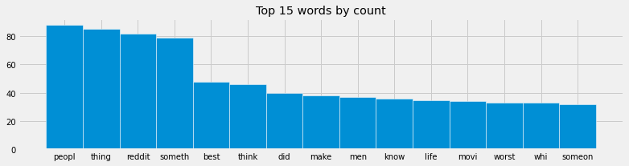

## Description

* Goal
    - Analyze the top 1,000 questions from r/askreddit and find similar threads

* Sample use cases:
    - Recommend similar questions when visiting a thread
    - Identify reposts
    - Outside of forums, this can also be used to suggest relevant news pieces about a particular topic that the user is reading

* Method
    - Stem words using nltk
    - Convert text to vector using bag-of-word method. The tally can be either by
        - (1) raw word frequency, or
        - (2) tf-idf
    - Use cosine similarity metric to find the closest matching thread name

* Observations (wip)
    - Thread names are usually short. Therefore using raw word count will yield higher similarity score than tf-idf because of repeated phrases (eg. what, you(r), etc.)
    - tf-idf works slightly better because rarer topics can be matched

* Takeaways
    - 1,000 samples are not much, considering the number of posts made daily. This is a limit from PRAW. I can potentially look for alternative sources that archive reddit posts and do an offline analysis (for exammple: monthly data). With more data points, the matching process will most likely improve.
    - Some of the matches found are not strictly accurate, but intersting. As a user, I would be definitely okay with this simple algorithm.

## Results
#### Most frequent words

#### Compare similarity score

#### Preview data

|    |   index | orig_thread                                                                                | best_match (count)                                                                                  | best_match (tf-idf)                                                |
|---:|--------:|:-------------------------------------------------------------------------------------------|:----------------------------------------------------------------------------------------------------|:-------------------------------------------------------------------|
|  0 |     382 | What would you do if you woke up in the 80's?                                              | Which celebrity went on the fastest, hardest and most destructive downwards spiral from their peak? | What’s your favorite 80’s movie?                                   |
|  1 |     348 | What is your strange turn-on?                                                              | What sucks about turning 30?                                                                        | what's the weirdest thing that's turned you on?                    |
|  2 |     638 | What's worse than a wet handshake?                                                         | What is 100% worse when wet?                                                                        | What is 100% worse when wet?                                       |
|  3 |     501 | Zoo workers of reddit, what is the dumbest thing someone has asked about an animal?        | What would you do if someone came up and asked if they could give you a hug?                        | What's the dumbest thing you believed as a child?                  |
|  4 |     950 | What is your favorite bromance in fiction?                                                 | Who are your favorite fictional couple?                                                             | Who is your favorite fictional doctor?                             |
|  5 |      56 | Women of reddit, whats the stupidest excuse a man has ever given you to not wear a condom? | Women of reddit, what is the grossest thing a man has said to you?                                  | Women of reddit, what is the grossest thing a man has said to you? |
|  6 |     763 | The world is now under the iron fist of Canada. What changes?                              | What's a piece of information that the world is not ready for?                                      | What is the most disturbing fact you know about Canada?            |
|  7 |     918 | what’s a song that everybody knows?                                                        | What song lyric is forever stuck in your head?                                                      | What do you hate that everybody seems to love?                     |
|  8 |     125 | When it comes to dating apps, what is an automatic “pass” for you?                         | What must one never do on a first date?                                                             | What must one never do on a first date?                            |
|  9 |     577 | Who’s someone you looked up to or idolized as a kid that you now can’t stand?              | If you had to name your kid after a disease/medical condition what would you name them?             | Who is a famous singer that you cannot stand their singing voice?  |